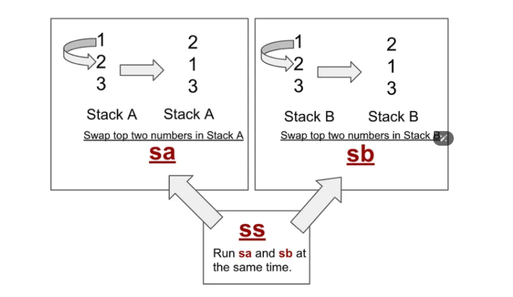
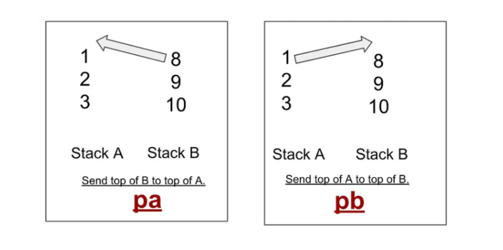
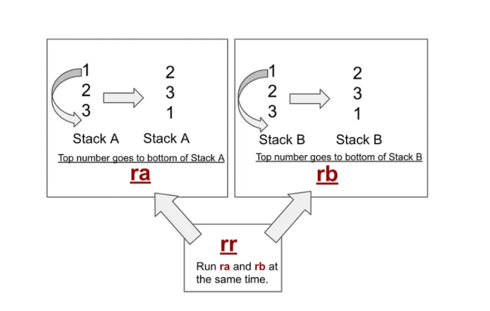
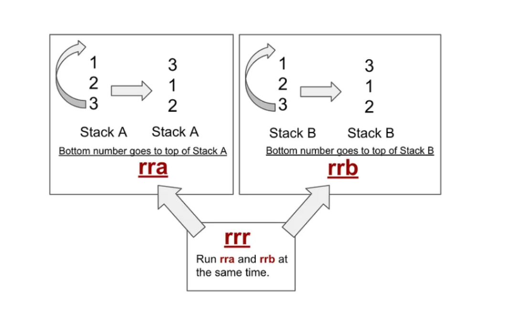
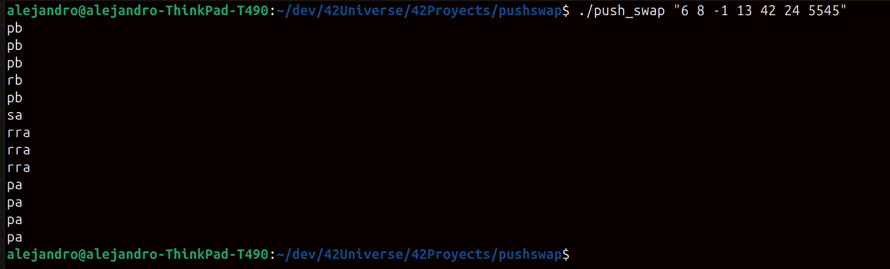
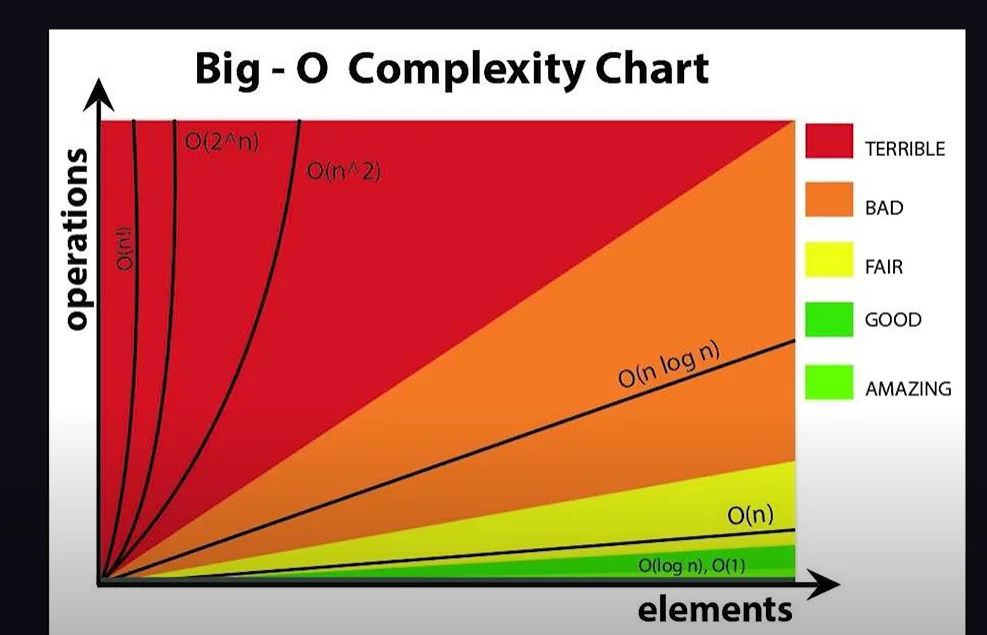

push_swap
=========

<div align="center">
	<strong><span style="font-size: 1.25em;">Complexity, big-O, Sorting algorithms, and lots of headaches</span></strong>
	<br />
	<br />
	<a href="https://42.fr/en/homepage/">
		
	</a>
	<a href="https://es.wikipedia.org/wiki/C_(lenguaje_de_programaci%C3%B3n)">
		
	</a>
	<a href="https://www.gnu.org/software/make/manual/make.html">
		
	</a>
	<a href="https://valgrind.org/">
		
	</a>
</div>


## 📖 Overview
This was my **fourth 42 project** and it focuses on **algorithmic complexity**, **Big-O notation**, and **numeric sorting algorithms**.
This 42 project is a deep dive into algorithmic complexity and Big-O notation. The goal is to sort a stack of random numbers using just one auxiliary stack and a highly restricted set of operations. The real catch is efficiency: the algorithm has to sort the numbers in the absolute minimum number of moves to hit strict evaluation limits, requiring some serious optimization and performance analysis.

## ✨ Key Features
- **Understanding Big O notation** and analyzing the time and space cost of algorithms.
- **Algorithmic complexity analysis** to optimize the number of operations.
- **Implementation and study of sorting algorithms** adapted to strict constraints.
- **Move-count optimization**, aiming for efficient solutions within project limits.
- **Use of linked data structures** for dynamic element management.
- **Circular buffer implementation** to simplify rotations and improve data access.
- **Stack-oriented algorithm design**, using limited operations to solve complex problems.
- **Advanced debugging techniques** for projects with many edge cases and emergent behavior.

<br>

---

## 🛠️ Requirements
Linux/Unix systems.

```bash
# Update package lists
sudo apt update

# C compiler and basic libraries
sudo apt install build-essential

# Valgrind
sudo apt install valgrind

# GNU Make
sudo apt install make
```

Dependencies included in this repository:
- Libft: my own C library included in this repository.
- Push Swap Checker: binary included in this repository.

## 🏗️ Build
```bash
make
```

## ▶️ Run
Usage example:
```bash
./push_swap "list of numbers"
```

Save the sequence to a variable and run:
```bash
NUMS="list of numbers" # replace with your generated numbers  Ex:"4 8 1 3 2 7 6 5"
./push_swap "$NUMS"
```

Check the result with the checker:
```bash
./push_swap "$NUMS" | ./checker_linux "$NUMS"
```

Check the move count:
```bash
./push_swap "$NUMS" | wc -l
```

<br>

---

## 🧾 Project Constraints
To complete this project you are allowed to use two **stacks**. You can choose whatever data structure you want to simulate them. Initially you receive a sequence of data as program arguments. You must parse it and ensure the numbers meet these conditions: they are **numeric**, they fit in **integers**, and there are **no duplicates**.

Then you must load them into your data structure (i chose a circular buffer) and start moving them to sort them. There are a gruopu of moves you can use to manipulate the stacks, but they are very specific and restrictive.

**Swap moves**
- `sa` — Swap the first two elements at the top of stack A. No-op if there are fewer than two elements.
- `sb` — Swap the first two elements at the top of stack B. No-op if there are fewer than two elements.
- `ss` — Perform `sa` and `sb` at the same time.

<div align="center">

</div>

**Push moves**
- `pa` — Take the first element at the top of stack B and push it onto stack A. No-op if B is empty.
- `pb` — Take the first element at the top of stack A and push it onto stack B. No-op if A is empty.

<div align="center">

</div>

**Rotate moves**
- `ra` — Shift all elements of stack A up by one. The first element becomes the last.
- `rb` — Shift all elements of stack B up by one. The first element becomes the last.
- `rr` — Perform `ra` and `rb` at the same time.

<div align="center">

</div>

**Reverse rotate moves**
- `rra` — Shift all elements of stack A down by one. The last element becomes the first.
- `rrb` — Shift all elements of stack B down by one. The last element becomes the first.
- `rrr` — Perform `rra` and `rrb` at the same time.

<div align="center">

</div>

<br>

Each move must be printed to **stdout** when executed. Each printed move counts as one point toward the move total (see "Performance Benchmarks").



<br>

> [!NOTE]
> The move images were extracted from this article by a 42 Silicon Valley peer: https://medium.com/@jamierobertdawson/push-swap-the-least-amount-of-moves-with-two-stacks-d1e76a71789a

### Performance Benchmarks
The final goal is to end with a fully sorted sequence and keep the total number of moves within specific limits.

<div align="center">

| Evaluation Status | 100 Numbers | 500 Numbers |
| :--- | :---: | :---: |
| **Max Validation (100%) + Bonus** | **< 700 ops** | **≤ 5500 ops** |
| Min Validation (80%) - Option A | < 1100 ops | < 8500 ops |
| Min Validation (80%) - Option B | < 700 ops | < 11500 ops |
| Min Validation (80%) - Option C | < 1300 ops | < 5500 ops |

</div>

## Algorithms, Complexity, and Big-O
This short preamble sets the context for **My Approach**. A program usually takes **input** data, **processes** it through a set of operations, and produces an **output**. An **algorithm** is the set of techniques used to perform that processing and deliver the result.

In computer science, many operations are built around **sorting** to make **searching** more efficient, and there are many different **sorting algorithms** (different techniques to do it). Here is where **algorithmic complexity** comes in. Complexity is an abstract measure that describes how an algorithm's execution cost grows as a function of the input size. That cost can be measured in different ways and there are different kinds of complexity (Example: time complexity, space complexity, Number of operations, other resource usage or constraints , etc.). **Big-O** describes how that cost grows as the input size **scales**.



<br />

> [!NOTE]
> If you want to dive deeper into these concepts, here are my Notion pages:
> - Algorithms and sorting: https://broken-snowdrop-f03.notion.site/Algoritmos-y-algoritmos-de-ordenacion-371b80eb3d8880088feaeee06db20774?pvs=74
> - Complexity and Big-O: https://app.notion.com/p/Big-o-and-complexity-analisisis-371b80eb3d8880aabe56ea6c582ff2e0

## My Approach - Kurdish Algorithm
Algorithms are based on **logical principles**, which is what makes them efficient for the tasks they solve. A good programmer must know how to choose the **right algorithm** for the problem at hand. In this project, the abstract measure we want to reduce for the given **input** (the list of numbers) is the **number of moves**, because that is the only benchmark that matters. You could technically build a program that spends **half an hour** calculating whatever it needs, just to output a sequence with very few moves, and it would still pass. That makes it clear that, here, complexity is not about **space**, **time**, or **runtime performance**. It is defined solely by whether the allowed moves meet the **benchmark thresholds**, and that perspective is what makes the idea of complexity really click.

Those moves are very specific. When you analyze them, you realize there are **no insertions**: you cannot pick elements from the middle of a stack or move elements inside a stack directly. You must use the allowed moves, and you can only operate at the **ends of the stacks**. **Sorting algorithms** are designed to solve this kind of problem, but if the task had no movement restrictions you could simply choose the algorithm that best fits your situation. With these constraints, the practical approach is to **extract their principles** and adapt them to this project.

Realizing those two things is **super, super important** to solve the project. At first, most people look at the existing algorithms. Later you realize only a few are practical here: **radix**, **bucket-based separation**, and a more **brute-force** strategy where you compute the cheapest move and execute it on each iteration. I chose an adaptation of that last approach. That algorithm has a known name, but a 42 student popularized it as the **Turk algorithm**. Since I adapted it to my own approach, I renamed it the **Kurdish algorithm**. And of course, for **user experience** and to be a good programmer, I also chose an approach that reduces **runtime complexity**.

## ℹ️ Resources
**Complexity and Big-O:**
- Complexity analysis notes - https://www.cs.us.es/~jalonso/cursos/i1m-19/temas/tema-28.html
- BettaTech complexity video - https://www.youtube.com/watch?v=IZgOEC0NIbw&ab_channel=BettaTech
- Algorithmic complexity without tears - https://youtube.com/watch?v=UPDjjuz1Hkw&si=8na6Xq8wxaWBWI7K
- Big-O made simple - https://www.youtube.com/watch?v=MyAiCtuhiqQ

**Circular buffer:**
- Circular buffer video - https://www.youtube.com/watch?v=uvD9_Wdtjtw&si=fq8AH9cUjq5X7OhC

**Algorithms and sorting:**
- Easy sorting algorithms explanation - https://www.youtube.com/watch?v=rbbTd-gkajw
- My Notion page on algorithms and sorting - https://app.notion.com/p/Algoritmos-y-algoritmos-de-ordenacion-371b80eb3d8880088feaeee06db20774?pvs=21
- Algorithm playlists - https://www.youtube.com/@MichaelSambol/playlists

**Data structures:**
- Roadmap for data structures and algorithms - https://roadmap.sh/datastructures-and-algorithms

**Push swap:**
- Tutorial - https://youtube.com/watch?v=wRvipSG4Mmk&si=2CtnvWbPqoiyP8Vy
- Article - https://medium.com/@ayogun/push-swap-c1f5d2d41e97

**Turk algorithm (cousin):**
- Turk algorithm explanation - https://pure-forest.medium.com/push-swap-turk-algorithm-explained-in-6-steps-4c6650a458c0

**Utils:**
- Push swap visualizer - https://codepen.io/ahkoh/pen/bGWxmVz
- Number generator - https://pinetools.com/es/generador-numeros-aleatorios

## 👨‍💻 Author
**Alejandro Carrillo - [https://github.com/alcarril/](https://github.com/alcarril/)**


